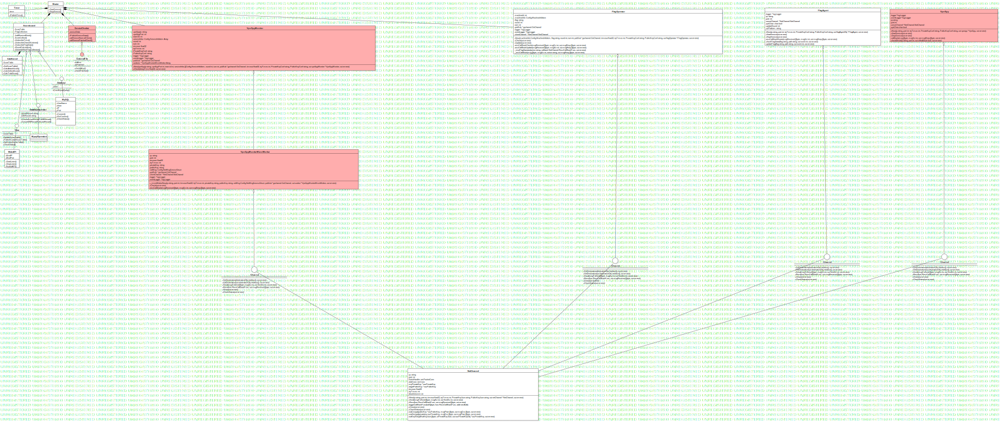

# MCDX Comptetion System
## About the project
This is a system for CTF comptetion(attack & defense) to monitor and score.

## Software Struct


## Usage
1. Clean the project
    ```
    $ make clean
    ```
2. Setting your comptetion environment(scripts/MCDXEnvConfig.py)
3. Generate config file for comptetion
    ```
    $ make GenYaml
    ```
4. Generate new rsa key for communication
    ```
    $ make GenKey
    ```
5. Compile all component
    ```
    $ make all
    ```
6. Deploy
    - RunFlagAgent
      - func: Renew the flag file
      - where: The target hosts of each team
    - VpnSpy
      - func: Detect illegal dos behavior
      - where： A intranet dedicated host for each team
    - Master
      - func: Calc the score(communicate with VpnSpy) and Renew the flag(communicate with RunFlagAgent)
      - where: The most secure lan with the scoreboard